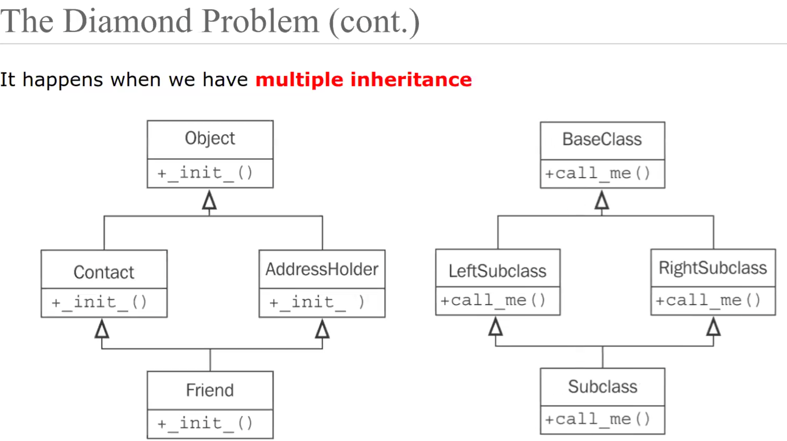

# Lecture 1

## Summary

* class extensions in python are in the format of...

```python
class ClassName(extendedType):
```



## Links

Zoom <https://washington.zoom.us/rec/play/YDh-VQWHWvb46OuIFRQvbptr05NO4Rj3RQLw_XqT_ULcVaHLTNt0awWFZ3rQlx5IWtYhTV7zeG9r2VUo.4Ij8EBaswS2SEwfh?canPlayFromShare=true&from=share_recording_detail&continueMode=true&componentName=rec-play&originRequestUrl=https%3A%2F%2Fwashington.zoom.us%2Frec%2Fshare%2Fi6Cy1jPD3Wfv5V10XOEm6PlZlOfkKFko06LyVDuetJoqbIhfO-j7oqYEhQx1Z_Fl.SinW_krXm4Vl5gPV>

Git <https://canvas.uw.edu/courses/1753639/files?preview=125083510>

Practice <https://docs.google.com/document/d/19TYdznw5aQ3xzcsfPNbr1goiAkLrE4sTHtsNOasBLsk/edit?tab=t.0>
